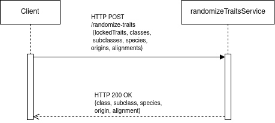

# randomize-traits

Microservice A for CS 361

## A. How to programmatically request data

The response can be requested using an HTTP POST request to the url <http://localhost:10000/randomize-traits>. The body of the request must be JSON and include the following poperties:

- lockedTraits: array of strings, where allowed values are the names of the five properties listed below
- classes: integer
- subclasses: array of integers
- species: integer
- origins: integer
- alignments: integer

Example call:

```
POST http://localhost:10000/randomize-traits HTTP/1.1
Content-Type: application/json

{
 "lockedTraits": [],
 "classes": 10,
 "subclasses": [3, 3, 4, 5, 2, 6, 3, 3, 4, 5],
 "species": 9,
 "origins": 12,
 "alignments": 9
}
```

## B. How to programmatically receive data

The service will return the data in a JSON object with any of these properties, depending on the values passed in the lockedTraits property in the request:

- class: integer
- subclass: integer
- species: integer
- origin: integer
- alignment: integer

Example:

```
POST http://localhost:10000/randomize-traits HTTP/1.1
Content-Type: application/json

{
 "lockedTraits": ["origins"],
 "classes": 10,
 "subclasses": [3, 3, 4, 5, 2, 6, 3, 3, 4, 5],
 "species": 9,
 "origins": 12,
 "alignments": 9
}

// {class: 2, subclass: 3, species: 7, alignment: 4}
```

## C. UML sequence diagram


